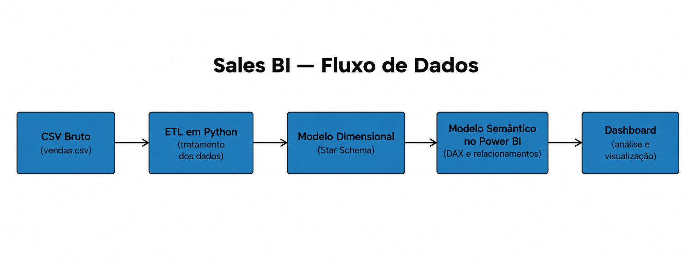
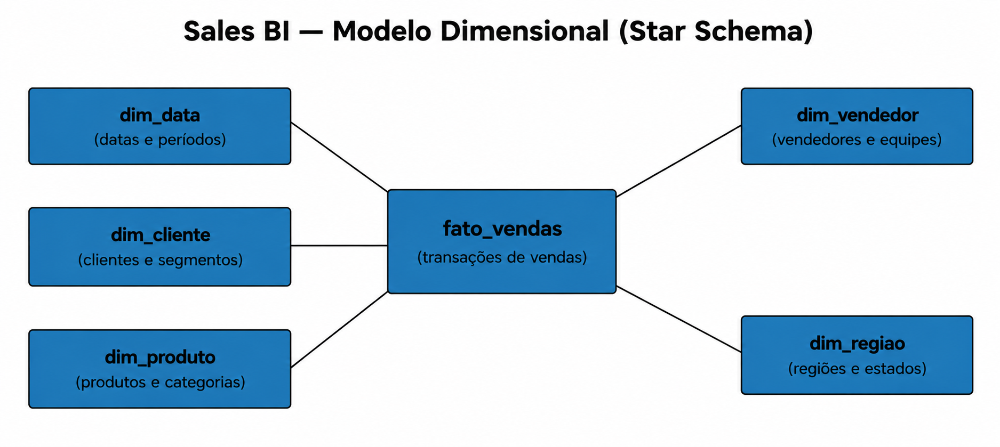

# Sales BI Dashboard

Projeto de **Business Intelligence end-to-end**, desenvolvido com **Python, SQL e Power BI**, com foco em análise de vendas, indicadores de desempenho e modelagem dimensional.

O projeto simula um cenário real de BI no qual dados transacionais passam por um processo de tratamento, modelagem e transformação até serem disponibilizados em um dashboard analítico.

## Objetivo

Demonstrar um fluxo completo de Business Intelligence:

```text
Dados transacionais brutos
        ↓
Python ETL / Qualidade dos dados
        ↓
Modelo dimensional
        ↓
SQL / Camada analítica
        ↓
Modelo semântico no Power BI
        ↓
Dashboard
```



O projeto foi desenvolvido com foco em **reprodutibilidade, separação de responsabilidades e boas práticas de modelagem de dados**.

---

## Tecnologias

* **Python / Pandas** — ETL e tratamento dos dados
* **SQL / PostgreSQL** — armazenamento e camada analítica
* **Power BI** — modelagem semântica, DAX e visualização
* **DAX** — criação de medidas e indicadores analíticos
* **Git / GitHub** — versionamento

---

## Estrutura do repositório

```text
sales-bi-dashboard/

├── README.md
├── requirements.txt
│
├── data/
│   ├── raw/
│   │   └── vendas.csv
│   │
│   └── processed/
│       └── .gitkeep
│
├── sql/
│   ├── create_tables.sql
│   ├── load_processed.sql
│   ├── views.sql
│   └── queries.sql
│
├── etl/
│   └── transform.py
│
├── powerbi/
│   ├── Sales_BI_Dashboard.pbix
│   └── measures.dax
│
└── docs/
    ├── dashboard-wireframe.png
    ├── modelagem.png
    ├── arquitetura.png
    └── data_dictionary.md
```

A pasta `data/processed/` é intencionalmente mantida vazia no versionamento.

Ela representa a **camada de saída do ETL**, e não uma fonte de dados.

Todas as tabelas analíticas são reconstruídas a partir do arquivo bruto.

---

# Dados de origem

O arquivo:

```text
data/raw/vendas.csv
```

representa um extrato transacional fictício de vendas.

O conjunto de dados contém informações relacionadas a:

* transações e datas
* clientes
* localização geográfica
* produtos
* vendedores
* canais de venda
* quantidade
* preço
* desconto
* custo
* status do pedido

Os dados foram propositalmente construídos com alguns problemas de qualidade para representar situações encontradas em processos reais de tratamento de dados.

Entre eles:

* transações duplicadas
* inconsistências de espaços em branco
* diferenças de capitalização
* segmentos de clientes ausentes
* pedidos cancelados
* devoluções

---

# ETL

O processo de transformação é executado pelo script:

```text
etl/transform.py
```

O pipeline possui uma única fonte de origem:

```text
data/raw/vendas.csv
```

Para executar:

```bash
python etl/transform.py
```

As dependências podem ser instaladas com:

```bash
pip install -r requirements.txt
```

Após a execução, são gerados os seguintes arquivos:

```text
data/processed/

├── vendas_tratadas.csv
├── fact_sales.csv
├── dim_customer.csv
├── dim_product.csv
├── dim_seller.csv
├── dim_region.csv
└── dim_date.csv
```

## Responsabilidades do ETL

O pipeline realiza as seguintes etapas:

1. validação do schema
2. remoção de duplicidades por `sale_id`
3. conversão e validação de tipos
4. limpeza de textos
5. normalização de estados e regiões
6. tratamento de segmentos de clientes ausentes
7. exclusão de pedidos cancelados
8. conversão de devoluções em movimentos negativos
9. cálculo de receita
10. cálculo de descontos
11. cálculo de custos
12. cálculo de lucro bruto
13. cálculo de margem
14. geração de calendário contínuo
15. criação das dimensões
16. criação da tabela fato
17. validação de integridade referencial
18. exportação das tabelas processadas

O objetivo é que nenhuma tabela dimensional ou fato precise ser mantida manualmente.

---

# Modelo dimensional

O projeto utiliza um **modelo dimensional em estrela (Star Schema)**.



A estrutura principal é:

```text
                         ┌──────────────┐
                         │   DimDate    │
                         └──────┬───────┘
                                │
                                │
┌──────────────┐         ┌─────▼──────┐         ┌──────────────┐
│ DimCustomer  │────────▶│  FactSales │◀────────│  DimSeller   │
└──────────────┘         └─────┬──────┘         └──────────────┘
                                │
                         ┌──────┴──────┐
                         │             │
                  ┌─────▼─────┐ ┌────▼──────┐
                  │ DimProduct│ │ DimRegion │
                  └───────────┘ └───────────┘
```

As dimensões se relacionam diretamente com a tabela fato, mantendo o modelo adequado para análises no Power BI.

## FactSales

**Grão:**

> Uma linha por transação de venda válida.

A tabela fato contém os principais valores utilizados nas análises:

* quantidade
* quantidade líquida
* receita bruta
* valor de desconto
* receita líquida
* custo total
* lucro bruto
* margem %

## DimCustomer

Contém informações relacionadas aos clientes:

* cliente
* segmento
* cidade
* estado

## DimProduct

Contém informações relacionadas aos produtos:

* produto
* categoria
* subcategoria

## DimSeller

Contém informações relacionadas aos vendedores:

* vendedor
* equipe comercial

## DimRegion

Centraliza as informações geográficas:

* região
* estado

## DimDate

Calendário contínuo criado a partir do intervalo de datas encontrado nos dados transacionais.

Essa dimensão permite análises temporais e serve como base para medidas relacionadas à evolução das vendas.

---

# PostgreSQL

Após executar o ETL, os dados processados podem ser carregados no PostgreSQL.

Exemplo:

```bash
createdb sales_bi

psql -U postgres -d sales_bi -f sql/create_tables.sql

psql -U postgres -d sales_bi -f sql/load_processed.sql

psql -U postgres -d sales_bi -f sql/views.sql
```

Consultas analíticas de exemplo estão disponíveis em:

```text
sql/queries.sql
```

A camada SQL permite explorar os dados antes da etapa de visualização e também demonstra a utilização do banco relacional como parte do fluxo de BI.

---

# Power BI

O Power BI utiliza as tabelas geradas pelo ETL para construir o modelo semântico e o dashboard.

O relacionamento segue o padrão:

```text
Dimensão 1:N FactSales
```

com as dimensões filtrando a tabela fato.

Principais tabelas utilizadas:

* `FactSales`
* `DimDate`
* `DimCustomer`
* `DimProduct`
* `DimSeller`
* `DimRegion`

As principais medidas DAX utilizadas no relatório estão documentadas em:

```text
powerbi/measures.dax
```

O arquivo fonte do relatório está disponível em:

```text
powerbi/Sales_BI_Dashboard.pbix
```

---

# Dashboard

O relatório atual possui três páginas principais.

## 1. Overview

Página executiva com uma visão geral do desempenho das vendas.

Principais indicadores apresentados:

* **Rceita**
* **Lucro Bruto**
* **Margem %**
* **Transações**

A página também apresenta análises relacionadas à evolução das vendas e à distribuição dos resultados por diferentes dimensões do negócio.

Entre as análises disponíveis estão:

* evolução temporal
* produtos
* categorias
* regiões
* vendedores

O objetivo é fornecer uma visão rápida do desempenho geral antes de aprofundar a análise.

---

## 2. Análise de Vendas

Página dedicada à análise do desempenho comercial.

Permite explorar os resultados considerando diferentes perspectivas, incluindo:

* região
* estado
* categoria
* canal de venda
* evolução de receita
* evolução do lucro bruto
* relação entre desconto e receita

Essa página permite identificar diferenças de desempenho entre mercados, canais e categorias, além de observar a evolução dos principais indicadores ao longo do tempo.

---

## 3. Clientes e Produtos

Página voltada para a análise do comportamento de clientes e produtos.

Entre as análises disponíveis estão:

* clientes
* segmentos
* produtos
* relação entre preço e lucro
* evolução temporal
* desempenho de produtos e clientes

O objetivo é complementar a visão comercial apresentada nas páginas anteriores, permitindo uma análise mais detalhada da composição dos resultados.

---

# Principais KPIs

Os principais indicadores atualmente apresentados no dashboard são:

| KPI             | Descrição                         |
| ----------------| --------------------------------- |
| **Receita**     | Receita líquida das vendas        |
| **Lucro Bruto** | Lucro bruto                       |
| **Margem %**    | Margem percentual sobre a receita |
| **Transações**  | Quantidade de transações válidas  |

Esses indicadores formam a camada principal de acompanhamento do dashboard atual.

---

# Melhorias futuras

O projeto pode ser expandido futuramente com:

* Revisão das medidas DAX para verificar quais estão efetivamente utilizadas no dashboard e remover medidas desnecessárias.
* Inclusão de novos KPIs, como **Units Sold**, **Average Ticket** e **Active Customers**.
* Adição de análises de crescimento e comparação entre períodos.
* Aprimoramento das interações do dashboard, incluindo **tooltips**, **drill-through** e filtros adicionais.
* Expansão das análises de clientes, produtos e devoluções.
* Adição de validações automatizadas para verificar a consistência dos dados após o ETL.

---

# Reprodutibilidade

O projeto foi desenvolvido seguindo o princípio de **uma única fonte de verdade**.

O arquivo:

```text
data/raw/vendas.csv
```

é a única fonte de dados do processo.

Todas as tabelas utilizadas nas etapas seguintes são derivadas dele.

Assim, um novo ambiente pode reconstruir a camada analítica executando:

```bash
python etl/transform.py
```

Isso permite reproduzir:

```text
Raw Data
    ↓
ETL
    ↓
Fact / Dimensions
    ↓
PostgreSQL
    ↓
Power BI
```

Nenhuma tabela dimensional ou tabela fato precisa ser mantida manualmente.

---

# Objetivo de portfólio

Além de demonstrar a construção de um dashboard, este projeto busca demonstrar conhecimentos em diferentes etapas de um fluxo de Business Intelligence:

* tratamento e qualidade de dados
* desenvolvimento de ETL
* Python e Pandas
* modelagem dimensional
* SQL e PostgreSQL
* criação de métricas com DAX
* modelagem semântica
* visualização de dados
* construção de dashboards
* organização e reprodutibilidade de projetos de dados

O foco está em demonstrar não apenas a criação de gráficos, mas a construção de uma **solução de BI completa, desde o dado bruto até a camada de análise**.

---

# Disclaimer

Todos os clientes, transações, produtos e valores financeiros utilizados neste projeto são **dados sintéticos**, criados exclusivamente para fins educacionais e de portfólio.

Nenhuma informação representa dados reais de empresas, clientes ou transações comerciais.